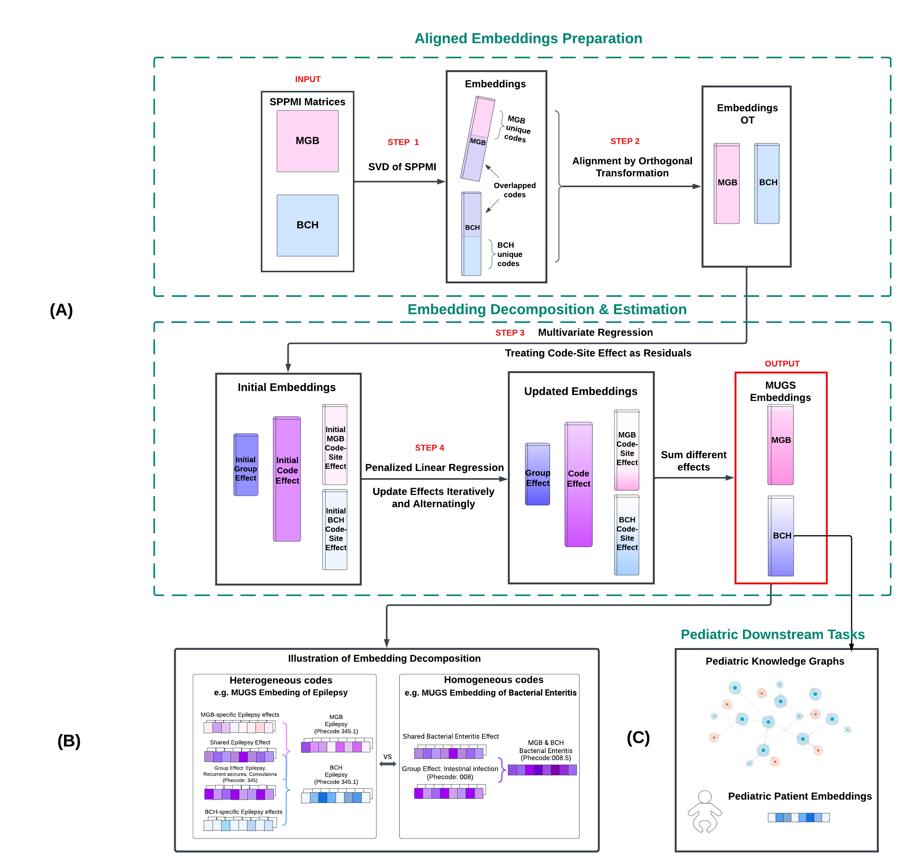

<!-- README.md is generated from README.Rmd. Please edit that file -->

```{r, include = FALSE}
knitr::opts_chunk$set(
  collapse = TRUE,
  comment = "#>",
  fig.path = "man/figures/README-",
  out.width = "100%"
)
```

# Multisource Graph Synthesis with EHR Data

[](https://CRAN.R-project.org/package=PheCAP)
(This badge is a placeholder; update it once MUGS is on CRAN.)

## Overview

## MUGS

We develop **MUlti-source Graph Synthesis (MUGS)**, an algorithm designed to create embeddings for pediatric EHR codes by leveraging graphical information from three distinct sources:

1. Pediatric EHR data
2. EHR data from the general patient population
3. Existing hierarchical medical ontology knowledge shared across different patient populations (e.g., PheCode, LOINC, RxNorm)

Utilizing existing hierarchical medical ontology as prior general knowledge, MUGS facilitates efficient transfer learning by grouping similar codes, thereby enhancing the transferability of knowledge from general to pediatric systems. To address the heterogeneity within code groups and between sites, we propose to decompose a code embedding into three components:

- **Group effect**: defined based on the hierarchical medical ontology.
- **Site-nonspecific code effect**: shared characteristics of a code that differ from its group effect.
- **Code-site effect**: site-specific characteristics of a code.

This decomposition, coupled with penalty functions applied to the code and code-site effects, allows adaptability to varying degrees of heterogeneity within code groups and between sites, and protects against negative knowledge transfer through hyperparameter tuning.



1. **Initial Embeddings**: Obtain two sets of initial embeddings (one per site) using the `get_embed()` function, then align them via an orthogonal Procrustes solution.
2. **Ontology-based Grouping**: Use existing hierarchical ontologies (e.g., [PheCodes, LOINC, RxNorms](https://shiny.parse-health.org/hierarchies/)) to group codes. Pool the aligned embeddings to initialize group, code, and code-site effects.
3. **Iterative Updates**: Update group effects, code effects, and code-site effects in an alternating fashion using `GroupEff_par`, `CodeSiteEff_l2_par`, and `CodeEff_Matrix`.

For hyperparameter tuning, we leverage known code-code pairs curated from the literature to select the optimal penalties on code effects and code-site effects, all evaluated with `evaluation.sim`. This helps distinguish established related code pairs from random pairs across a wide range of scenarios.

While real data from MGB and BCH cannot be shared, we offer a [Shiny App](https://shiny.parse-health.org/multi-view-net/) for exploring MUGS embeddings in downstream tasks such as pediatric feature engineering and knowledge graph construction.

---

## Installation

Install the stable version from CRAN (once available):

```{r, eval=FALSE}
install.packages("MUGS")

```

## Getting Started

Load the simulated data (if provided) and review the example code in the `vignettes/MUGS.Rmd`. 

For real EHR data:
1. Convert your data into the same format as the simulated data.
2. Call the main function `MUGS()` with your formatted data as input.

Here is a simplified illustration of the workflow (not actual production code):

```{r, eval=FALSE}
library(MUGS)
## Step 1: Get initial embeddings
embeddings_site1 <- get_embed(data_site1, method = "someMethod")
embeddings_site2 <- get_embed(data_site2, method = "someMethod")
## Step 2: Align them (Orthogonal Procrustes)
aligned <- align(embeddings_site1, embeddings_site2)
site1_aligned <- aligned$aligned1
site2_aligned <- aligned$aligned2
#Step 3: Use an existing ontology to group codes
group_info <- create_groups_from_ontology("hierarchy_file")
## Initialize group/code/code-site effects
groupEff_init <- init_group_effect(group_info, list(site1_aligned, site2_aligned))
codeEff_init <- init_code_effect(list(site1_aligned, site2_aligned))
siteEff_init <- init_code_site_effect(list(site1_aligned, site2_aligned))
## Iterative updates
for (iter in 1:max_iter) {
groupEff_init <- GroupEff_par(groupEff_init, codeEff_init, siteEff_init, ...)
siteEff_init <- CodeSiteEff_l2_par(groupEff_init, codeEff_init, siteEff_init, ...)
codeEff_init <- CodeEff_Matrix(groupEff_init, codeEff_init, siteEff_init, ...)
}
## Step 4: Hyperparameter tuning using known code-code pairs
known_pairs <- data.frame(code1 = c("A"), code2 = c("B"))
performance <- evaluation.sim(codeEff_init, known_pairs)
```


## Citation

If you use **MUGS** in your research, please cite:

Li, M., Li, X., Pan, K., Geva, A., Yang, D., Sweet, S. M., Bonzel, C.-L., Panickan, V. A., Xiong, X., Mandl, K., & Cai, T. (2024).  
**Multisource representation learning for pediatric knowledge extraction from electronic health records.**  
*npj Digital Medicine*. [https://doi.org/10.1038/s41746-024-01320-4](https://doi.org/10.1038/s41746-024-01320-4)

---

**Thank you for using MUGS!** For issues or feature requests, please open an issue at [https://github.com/celehs/MUGS](https://github.com/celehs/MUGS).
